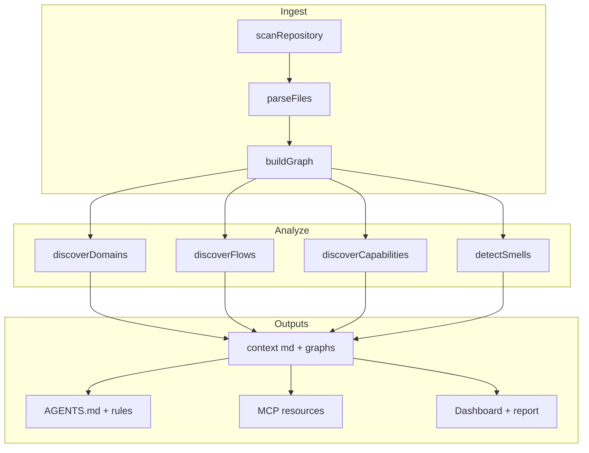
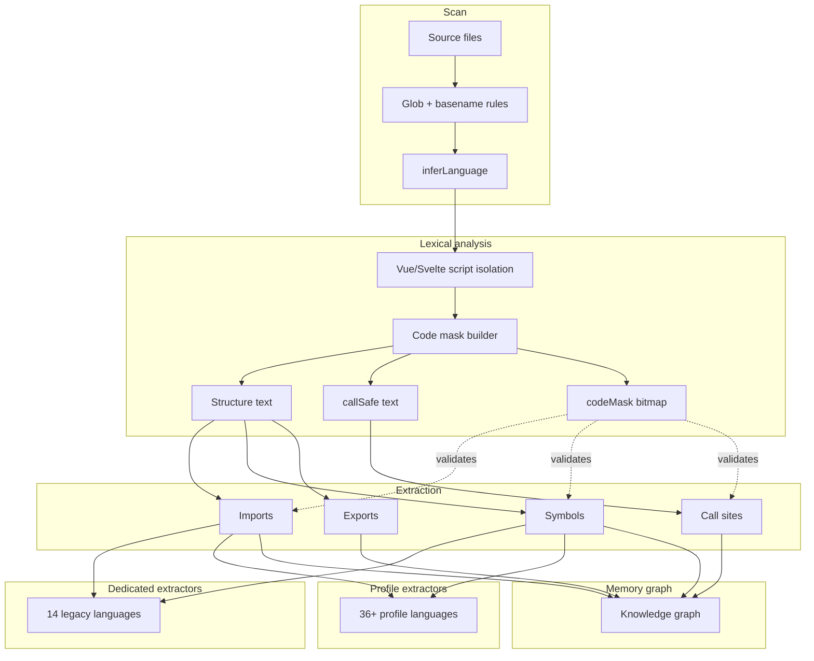
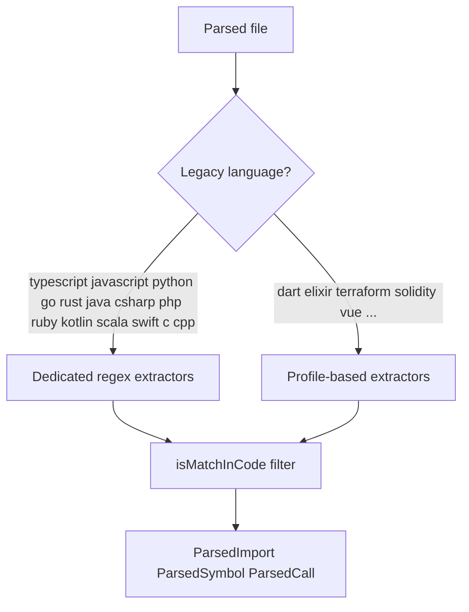
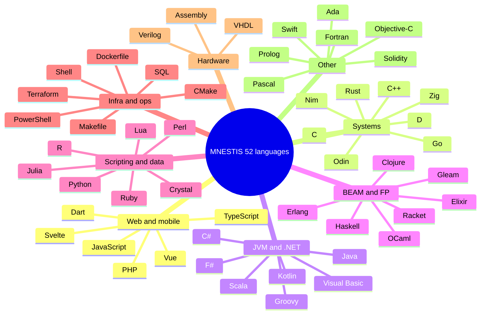

<!-- Auto-generated by MNESTIS — run `npm run docs:sync` to refresh -->

# MNESTIS Architecture Graphs

MNESTIS embeds **Mermaid diagrams** in markdown everywhere architecture matters — repo docs, `.MNESTIS/context/`, `AGENTS.md`, MCP resources, and the dashboard.

## Where graphs appear

| Location | Generated | Contents |
|----------|-----------|----------|
| [`docs/GRAPHS.md`](./GRAPHS.md) | `npm run docs:sync` | This catalog (static) |
| [`docs/LANGUAGES.md`](./LANGUAGES.md) | `npm run docs:sync` | 52-language pipeline + families |
| [`docs/architecture.md`](./architecture.md) | Hand-maintained + sync sections | System pipeline |
| `.MNESTIS/context/graphs.md` | `MNESTIS build` | **Per-repo** domain, flow, dependency, risk charts |
| `.MNESTIS/context/languages.md` | `MNESTIS build` | **Per-repo** language pie + parsing pipeline |
| `.MNESTIS/context/architecture.md` | `MNESTIS build` | Layers + services + language section |
| `.MNESTIS/context/domains.md` | `MNESTIS build` | Domain interaction graph |
| `.MNESTIS/context/flows.md` | `MNESTIS build` | Flow overview + step diagrams |
| `.MNESTIS/context/dependencies.md` | `MNESTIS build` | Top edges + service graph |
| `.MNESTIS/context/critical_paths.md` | `MNESTIS build` | High-risk path diagram |
| `.MNESTIS/context/smells.md` | `MNESTIS build` | Smell severity pie |
| `AGENTS.md` | `MNESTIS setup` | Domain graph + language pipeline |

## End-to-end build pipeline

## Language parsing pipeline (52 languages)

## Extractor routing

## Language families

## Per-repository diagram types

After `npx MNESTIS .`, open `.MNESTIS/context/graphs.md` for repo-specific charts:

| Diagram | Source data | Markdown section |
|---------|-------------|------------------|
| Architecture layers | `architecture.layers` | `graphs.md` · `architecture.md` |
| Domain map | Import + call clustering | `graphs.md` · `domains.md` |
| Flow overview | Execution flows | `graphs.md` · `flows.md` |
| Service dependencies | Service graph | `graphs.md` · `dependencies.md` |
| Top dependency edges | Weighted IMPORTS | `dependencies.md` |
| Critical paths | Blast-radius paths | `critical_paths.md` |
| Capabilities map | Product features | `graphs.md` |
| User journeys | Journey systems | `graphs.md` |
| Language pie | File counts by language | `languages.md` · `graphs.md` |
| Risk heatmap | Domain risk scores | `graphs.md` |
| Smell severity | Architecture smells | `smells.md` |

## Rendering tips

- **GitHub / GitLab** — Mermaid renders natively in `.md` files
- **Cursor / VS Code** — Markdown preview with Mermaid extension
- **Agents** — Point at `.MNESTIS/context/graphs.md` before editing cross-cutting code

## Implementation

| Module | Role |
|--------|------|
| `packages/core/src/graph/mermaid.ts` | Domain, flow, service, risk diagrams |
| `packages/core/src/languages/docs.ts` | Language pipeline + pie charts |
| `packages/core/src/context/graph-markdown.ts` | Composes `.MNESTIS/context/graphs.md` |
| `packages/core/src/context/compiler.ts` | Writes all `context/*.md` at build time |
