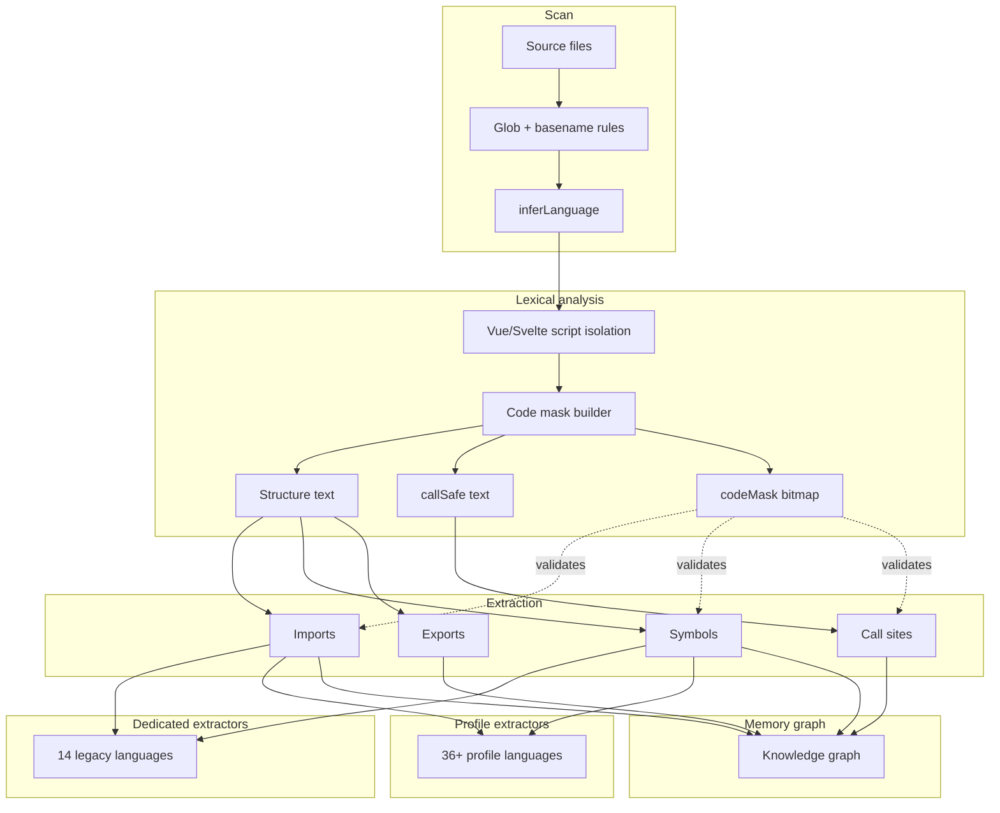
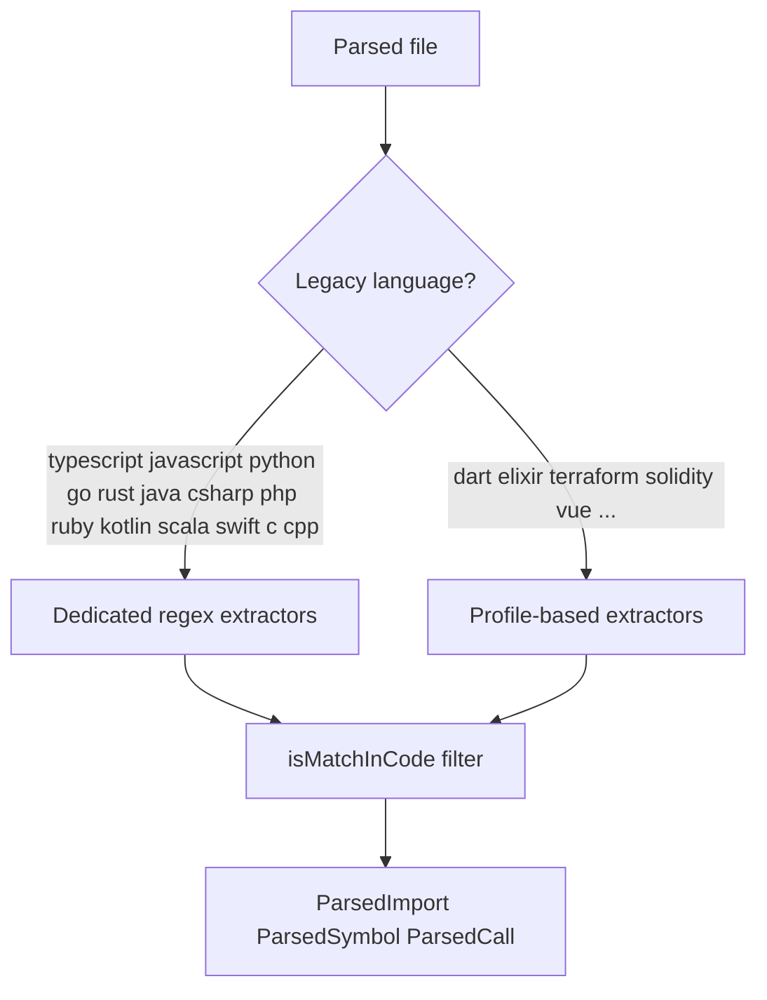
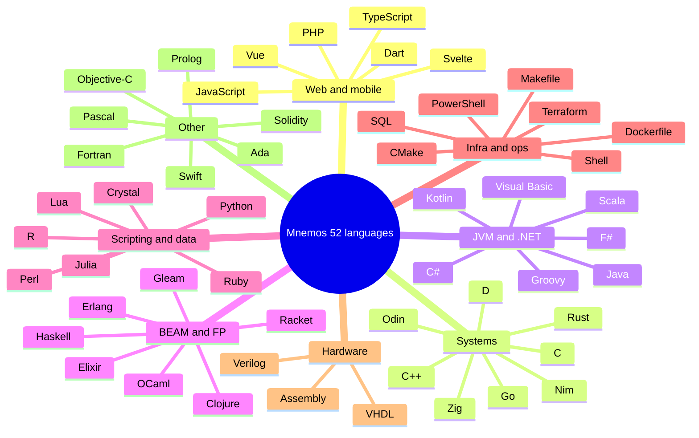

# Mnemos Language Support

Mnemos analyzes **52 programming languages** with a production-grade lexical pipeline — not extension counting alone. Every supported language flows through comment/string-aware extraction before imports, symbols, and call edges reach the knowledge graph.

## Why this matters

| Capability | Toy parser | Mnemos |
|------------|------------|--------|
| Comment-safe imports | Often false positives | `codeMask` rejects matches inside comments |
| String-safe imports | Matches `import` inside strings | Lexical mask + validation |
| Vue / Svelte | Template noise pollutes graph | `<script>` isolation only |
| Polyglot repos | Miss files or mis-label | 52 languages + Dockerfile/Makefile/CMake |
| Graph quality | Regex on raw text | Dedicated extractors + profile families + dedupe |

## Parsing pipeline



## Extractor routing



## Language families



## Full language list

| Category | Languages |
|----------|-----------|
| **Web & mobile** | Dart, JavaScript, PHP, Svelte, TypeScript, Vue |
| **Systems** | Assembly, C, C++, D, Go, Nim, Odin, Rust, Zig |
| **JVM & .NET** | C#, F#, Groovy, Java, Kotlin, Scala, Visual Basic .NET |
| **BEAM & functional** | Clojure, Elixir, Erlang, Gleam, Haskell, OCaml, Racket |
| **Scripting & data** | Crystal, Julia, Lua, Perl, Python, R, Ruby |
| **Infra & ops** | CMake, Dockerfile, Makefile, PowerShell, SQL, Shell, Terraform |
| **Apple** | Objective-C, Swift |
| **Web3** | Solidity |
| **Hardware description** | VHDL, Verilog |
| **Scientific & legacy** | Ada, Fortran, Pascal, Prolog |

## Implementation map

| Module | Role |
|--------|------|
| `packages/core/src/languages/registry.ts` | 50 language definitions + extractor profiles |
| `packages/core/src/languages/index.ts` | Extension/basename inference, public API |
| `packages/core/src/parser/source-mask.ts` | Lexical code mask, Vue/Svelte script isolation |
| `packages/core/src/parser/profile-extractors.ts` | Profile imports/symbols/calls with validation |
| `packages/core/src/parser/index.ts` | Legacy + profile dispatch into graph builder |
| `packages/core/src/scanner/index.ts` | Multi-language file discovery |

## Adding a language

1. Add a `LanguageDefinition` entry in `registry.ts`
2. Add or reuse an `ExtractorProfile` with import/symbol rules
3. Add inference tests in `languages/languages.test.ts`
4. Run `npm test` in `packages/core`

See [CONTRIBUTING.md](../CONTRIBUTING.md#language-and-parser-changes).

## API

```typescript
import {
  SUPPORTED_LANGUAGE_COUNT,
  SUPPORTED_LANGUAGES,
  inferLanguage,
  getLanguageDefinition,
} from '@mnemos/core';
```
