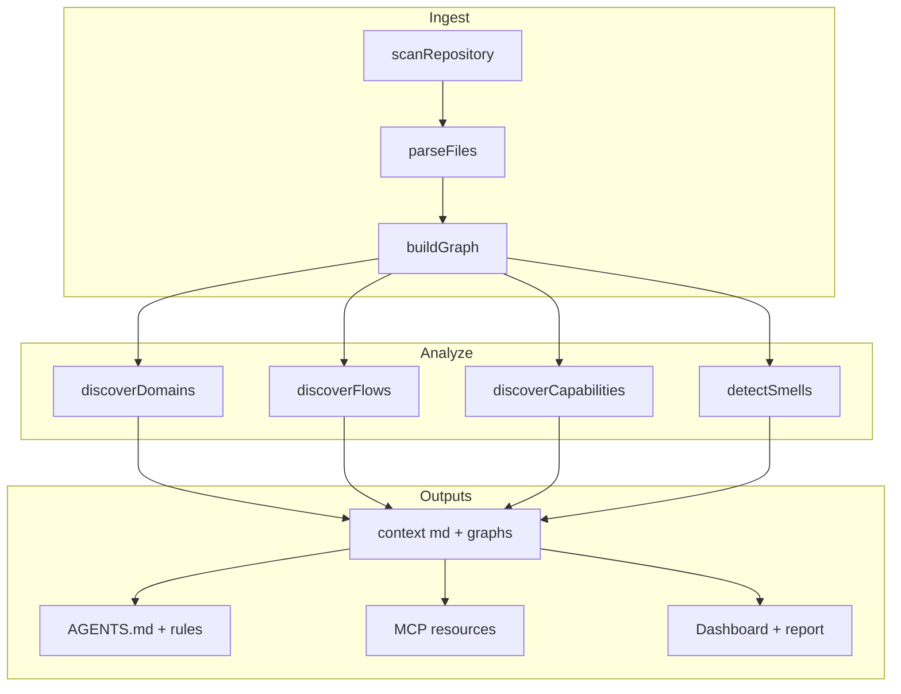
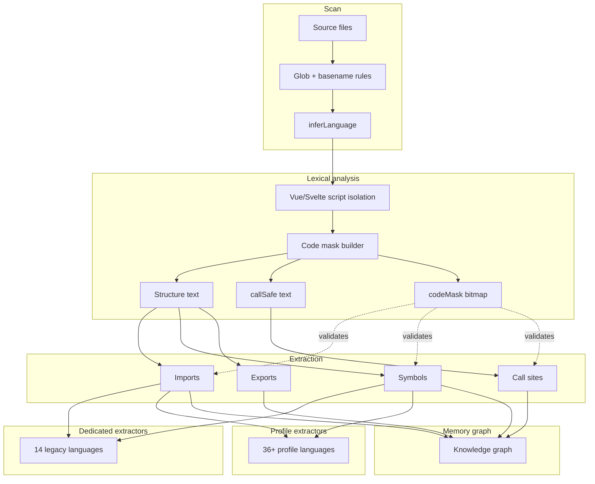
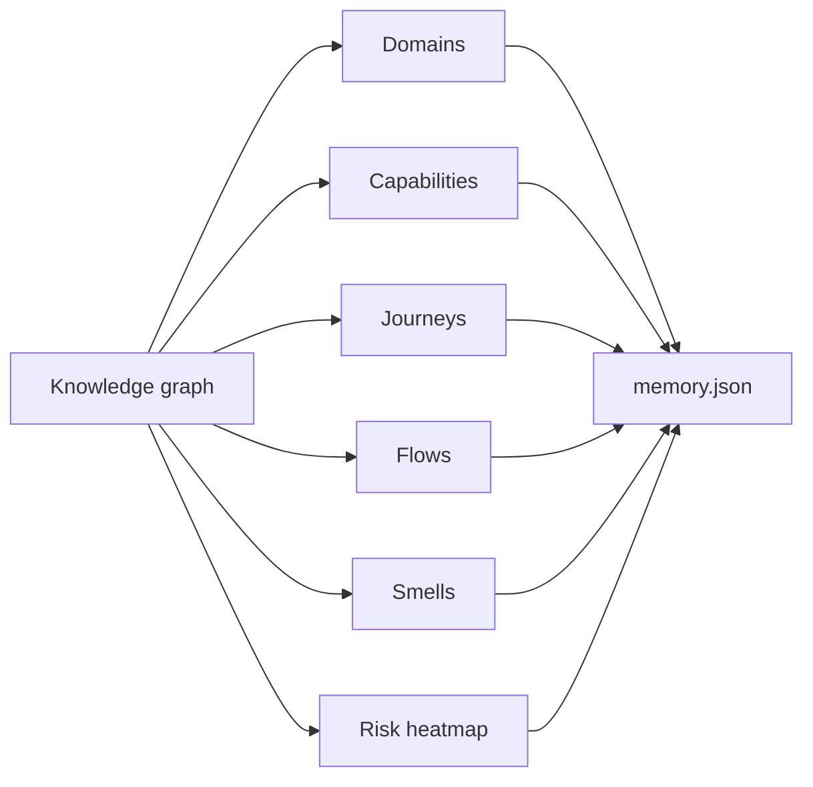

# Mnemos Architecture

Mnemos transforms a codebase into structured intelligence through a local-first pipeline.

<!-- Auto-generated by Mnemos — run `npm run docs:sync` to refresh -->

## System pipeline

## Scanner

Walks the repository filesystem (respecting `.gitignore`), detects **52 languages**, and feeds files through the lexical parsing pipeline. Output: parsed imports, symbols, calls, and file nodes.

See **[LANGUAGES.md](./LANGUAGES.md)** for the full language list, families mindmap, and extractor routing.

## Analyzer

Runs on the in-memory graph:

- **Domains** — business boundaries from directory structure and imports
- **Capabilities** — product features inferred from routes, handlers, and naming
- **Journeys** — user-facing flows from entry points to outcomes
- **Flows** — execution paths through the call graph
- **Smells** — architecture anti-patterns (god modules, circular deps, etc.)
- **Heatmap** — per-domain risk scoring
- **AI readiness** — six dimensions for agent-friendliness

## Memory

Written to `.mnemos/` after `mnemos build`:

| File | Purpose |
|------|---------|
| `memory.json` | Full memory model |
| `project.dna.json` | Compressed DNA (~few KB) — read this first |
| `agent_context.json` | Machine-optimized bundle |
| `graph.json` | Dependency graph for visualization |
| `health-score.json` | Five-dimension health score |
| `context/*.md` | Human-readable docs with **Mermaid graphs** |

### Context markdown index

| File | Graphs included |
|------|-----------------|
| [`graphs.md`](./GRAPHS.md) | Master index — all diagram types |
| `languages.md` | Language pie + pipeline + routing |
| `architecture.md` | Layers, domain overview, capabilities |
| `domains.md` | Domain interaction graph |
| `flows.md` | Flow overview + per-flow steps |
| `dependencies.md` | Top edges + service dependency graph |
| `critical_paths.md` | Critical path diagram |
| `smells.md` | Smell severity pie |
| `repository_summary.md` | Layers + language pie + domain snapshot |

Run `npx mnemos .` on any repo to generate the full set under `.mnemos/context/`.

## Outputs

All outputs call the same **`buildAiPack`** builder in `packages/core/src/ai-pack.ts`:

1. **Dashboard** — React Router v7 app with Vibe / AI / Coder cockpits
2. **Report** — static HTML from `report-template.ts`
3. **AI Pack v1** — JSON via CLI, serve, and `/api/json/:repoId`
4. **MCP + REST** — `MnemosRuntime` shared by `mnemos serve` and `mnemos mcp`

## Packages

| Package | Role |
|---------|------|
| `@mnemos/core` | Scanner, analyzer, memory, AI Pack, report, serve, MCP |
| `@mnemos/cli` | `mnemos` command-line interface |
| `@mnemos/ui` | Vite + React dashboard |

## Design principles

- **Local-first** — no telemetry, no cloud, no required API keys
- **Single source of truth** — one AI Pack builder, one runtime
- **Modes are routes** — `/vibe/…`, `/ai/…`, `/coder/…`
- **Graphs in markdown** — every context doc ships Mermaid for humans and agents

## Related docs

- [GRAPHS.md](./GRAPHS.md) — full diagram catalog
- [LANGUAGES.md](./LANGUAGES.md) — 52-language parsing reference
- [modes.md](./modes.md) — Vibe / AI / Coder routes
- [ai-pack.md](./ai-pack.md) — AI Pack v1 specification
