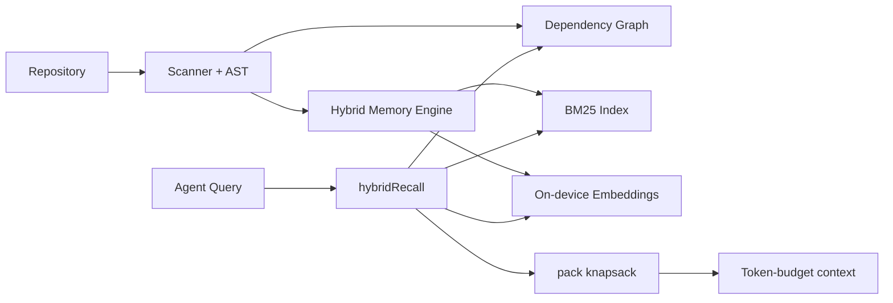

# mnestis

# Mnestis — persistent memory for AI agents

> **Formerly Mnemos/Mnestis.** Local-first codebase memory: graph + vector hybrid recall, token-budget packing, MCP for Cursor & Claude Code.

[](https://www.npmjs.com/package/mnestis)
[](https://github.com/bitreonx/Mnestis/blob/main/LICENSE)
[](https://github.com/bitreonx/Mnestis)

## 60-second quickstart

```bash
npx mnestis launch . --platform cursor   # build + install MCP + rules
mnestis memory context "fix auth bug" --budget 4000
# → context trimmed: 4,200 → 900 tokens (saved 78%)
```

## Architecture



## Recipes

| Task | Command |
|------|---------|
| Build memory | `mnestis build .` |
| Hybrid recall | `mnestis memory query "auth middleware"` |
| Pack context | `mnestis memory context "fix bug" --budget 4000` |
| Remember fact | `mnestis memory remember "uses JWT" --tag auth` |
| MCP server | `mnestis mcp` |

## API (programmatic)

```ts
import { hybridRecall, pack, decayScore, summarizeCold } from '@mnestis/core';

const result = pack(memories, 4000);
console.log(formatPackSavings(result));
```

Framework adapters: LangChain, Vercel AI SDK, OpenAI Agents — see `@mnestis/core/adapters`.

## Benchmarks

```bash
npm run bench:compare
```

Reproducible token compression vs naive file dump. Express blind-eval: **80% precision@5**, **29×** context compression.

## Install

```bash
npm install -g mnestis
```

[mnestis.vercel.app](https://mnestis.vercel.app) · [Achievements](https://mnestis.vercel.app/achievements) · [GitHub](https://github.com/bitreonx/Mnestis)
