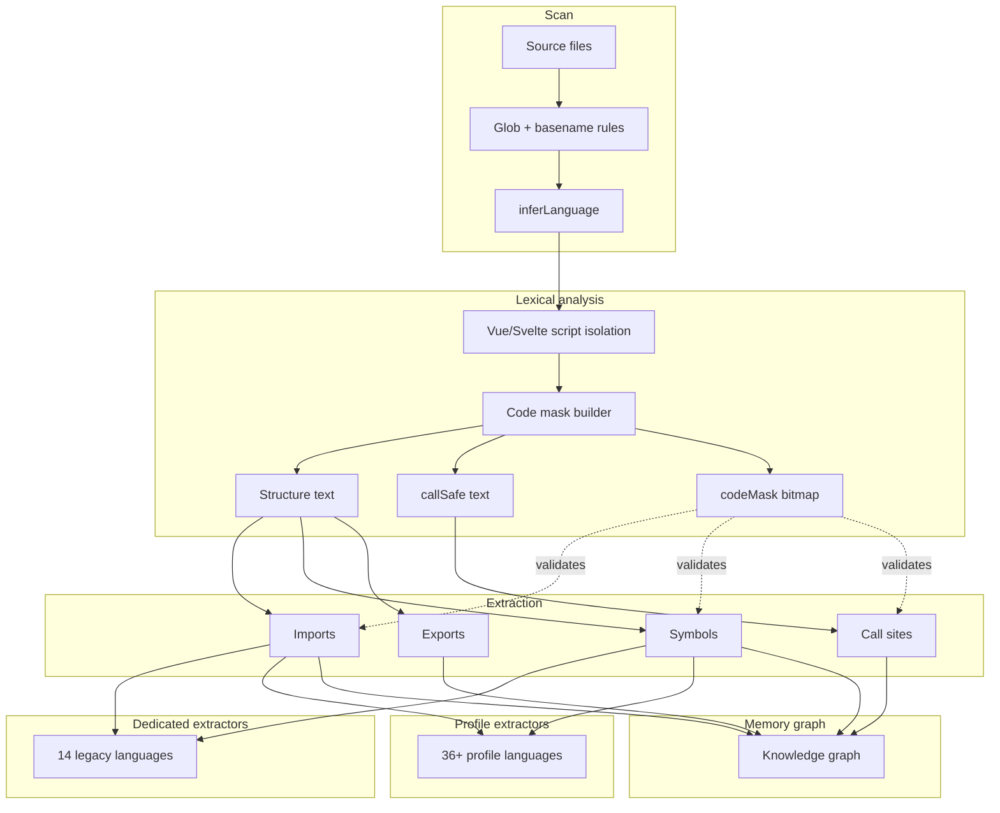

# Mnemos Context — sample-app

> Generated at `2026-06-24T11:40:03.432Z` · Mermaid diagrams render in GitHub, Cursor, and VS Code

## Start here

| Priority | File | Why |
|----------|------|-----|
| 1 | [repository_summary.md](./repository_summary.md) | Stats, layers, language pie |
| 2 | [graphs.md](./graphs.md) | **All architecture diagrams** |
| 3 | [languages.md](./languages.md) | Stack breakdown + parsing pipeline |
| 4 | [architecture.md](./architecture.md) | Services, layers, capabilities |

## Full index

| File | Graphs |
|------|--------|
| [graphs.md](./graphs.md) | Domain · flow · service · dependency · risk · language · pipeline |
| [languages.md](./languages.md) | Pie chart · language flow · extractor routing · families |
| [architecture.md](./architecture.md) | Layers · domains · capabilities · language section |
| [domains.md](./domains.md) | Domain interaction graph |
| [flows.md](./flows.md) | Flow overview + step diagrams |
| [dependencies.md](./dependencies.md) | Top edges + service graph |
| [critical_paths.md](./critical_paths.md) | High-risk path diagram |
| [smells.md](./smells.md) | Smell severity pie |
| [services.md](./services.md) | Service catalog |
| [apis.md](./apis.md) | Route/API table |

## Build pipeline

Re-run `mnestis build` after structural changes to refresh every chart.
