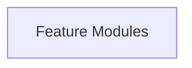
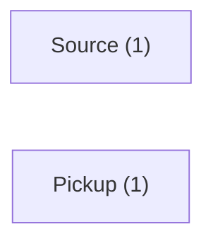
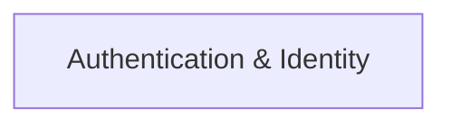
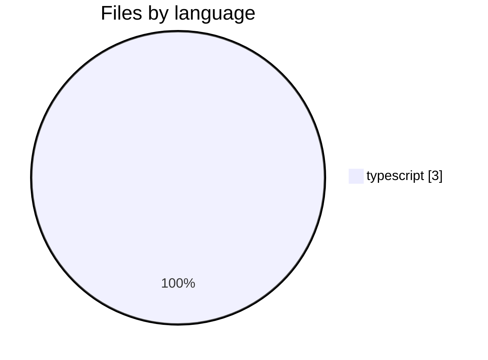
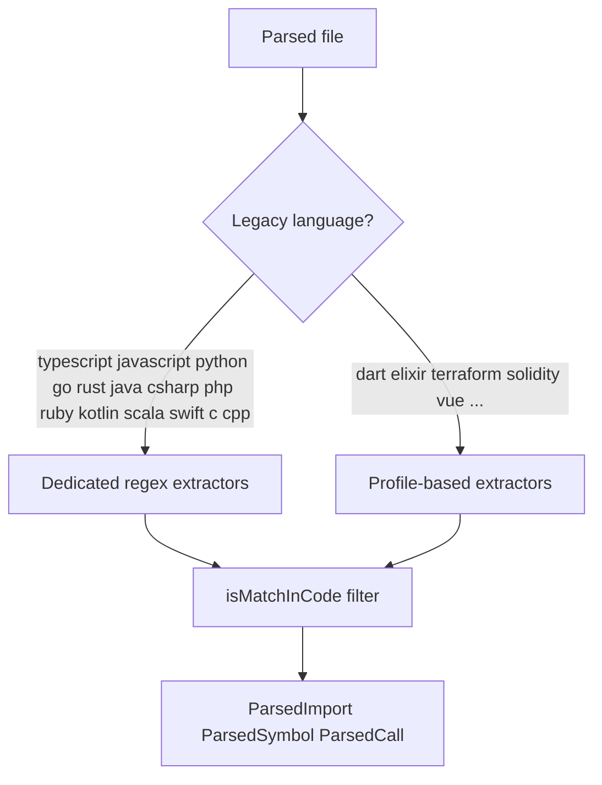
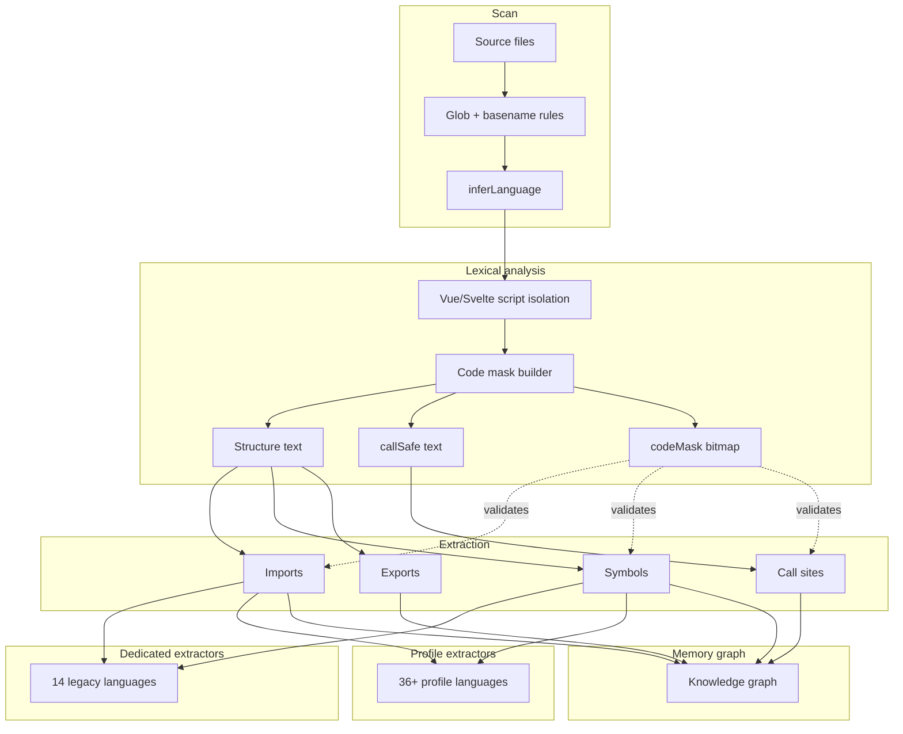

# Architecture — sample-app

## System Type

Single Package

## Layers

1. **Feature Modules**

## Services

### app
- **Domain**: Unassigned
- **Path**: `app`
- **Dependencies**: none
- **Dependents**: app
- **Key exports**: none

### src
- **Domain**: Source
- **Path**: `src`
- **Dependencies**: none
- **Dependents**: src
- **Key exports**: none

## Architecture layers

## Domain overview

## Capabilities map

## Languages & parsing

**Detected in this repo:** typescript (3)

Mnemos uses a lexical code-mask pipeline (52 languages engine-wide). Imports and symbols are extracted only from real code regions — not comments, strings, or Vue templates.

