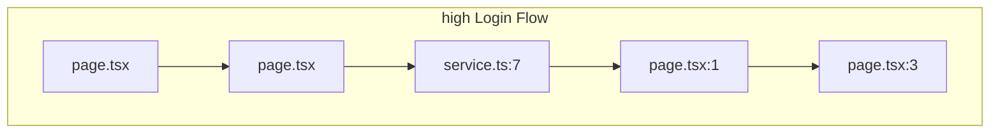

# Critical Paths

High-risk paths where changes have wide blast radius.

## Critical path diagram

## Login Flow

- **Risk**: HIGH
- **Nodes involved**: 5
- **Description**: Login Flow spanning 1 related files
