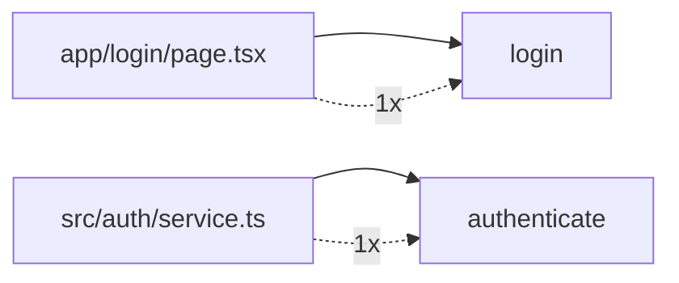
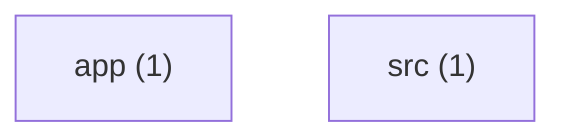

# Key Dependencies

Top dependency relationships by frequency.

## Dependency graph (top edges)

## Service dependency graph

- **app/login/page.tsx → login**: 1 references
- **src/auth/service.ts → authenticate**: 1 references
