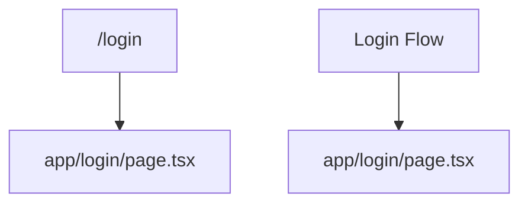
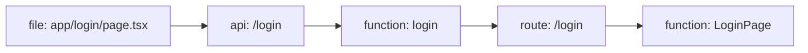

# Execution Flows

2 flows detected across the codebase.

## Flow overview



### /login

HTTP request: 5 steps through file → api → function → route



### Login Flow

Login Flow spanning 1 related files


## Request Flows

### /login

- **Type**: request
- **Confidence**: 90%
- **Entry**: `app/login/page.tsx`
- **Steps**: 5

```
1. [file] app/login/page.tsx (app/login/page.tsx)
2. [api] /login (app/login/page.tsx)
3. [function] login (src/auth/service.ts:7)
4. [route] /login (app/login/page.tsx:1)
5. [function] LoginPage (app/login/page.tsx:3)
```

HTTP request: 5 steps through file → api → function → route

## User Journey Flows

### Login Flow

- **Type**: user_journey
- **Confidence**: 65%
- **Entry**: `app/login/page.tsx`
- **Steps**: 5

```
1. [file] app/login/page.tsx (app/login/page.tsx)
2. [api] /login (app/login/page.tsx)
3. [function] login (src/auth/service.ts:7)
4. [route] /login (app/login/page.tsx:1)
5. [function] LoginPage (app/login/page.tsx:3)
```

Login Flow spanning 1 related files
