# Architecture Graphs — sample-app

> Mermaid diagrams generated by Mnemos at build time. Render in GitHub, Cursor, VS Code, or any Mermaid-capable viewer.

## System layers

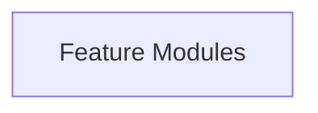

## Domain map

Cross-domain dependency edges inferred from imports and call graph.

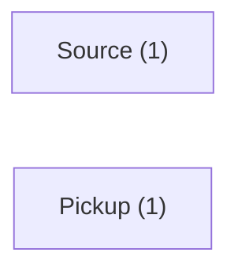

## Execution flows

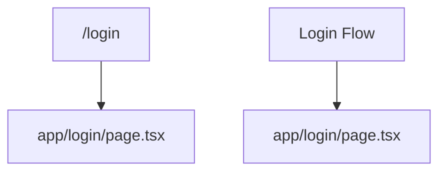

### Top flow detail

**/login** — HTTP request: 5 steps through file → api → function → route

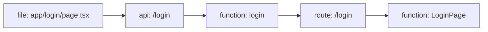

## Service dependencies

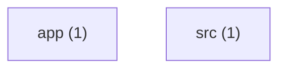

## Key dependency edges

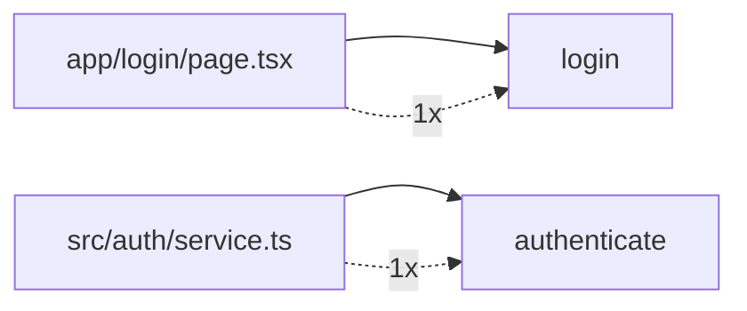

## Critical paths

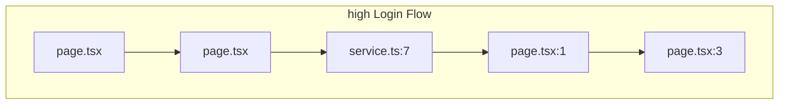

## Capabilities

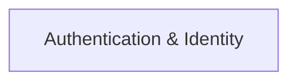

## User journeys

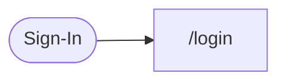

## Language distribution

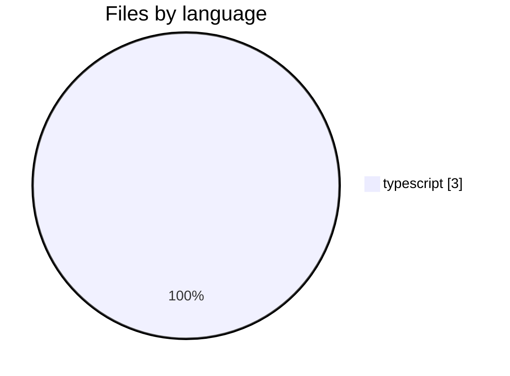

## Language families (engine)

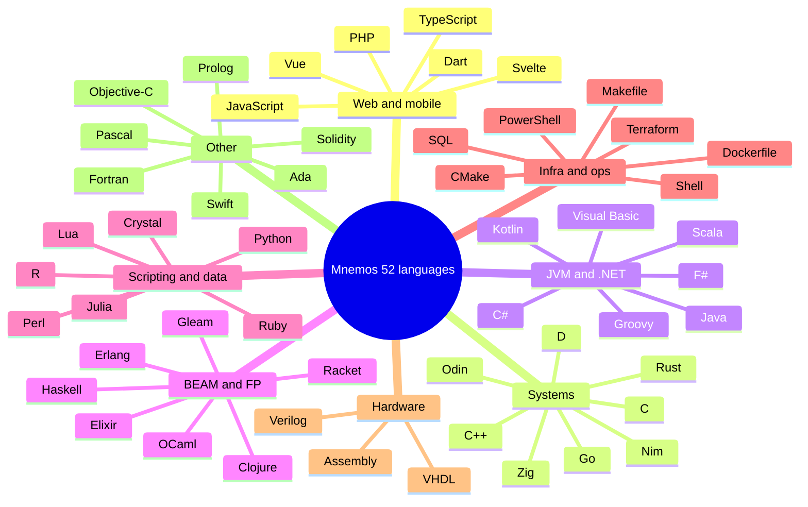

## Parsing pipeline (1 detected · 52 supported)

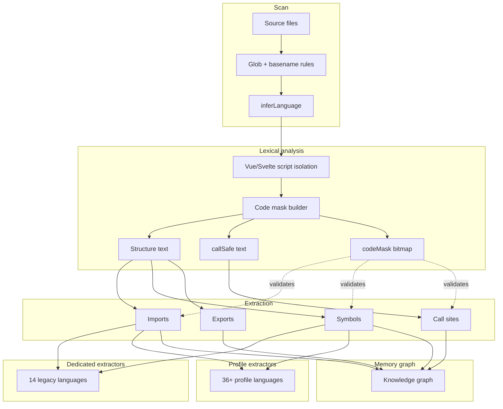

## Extractor routing

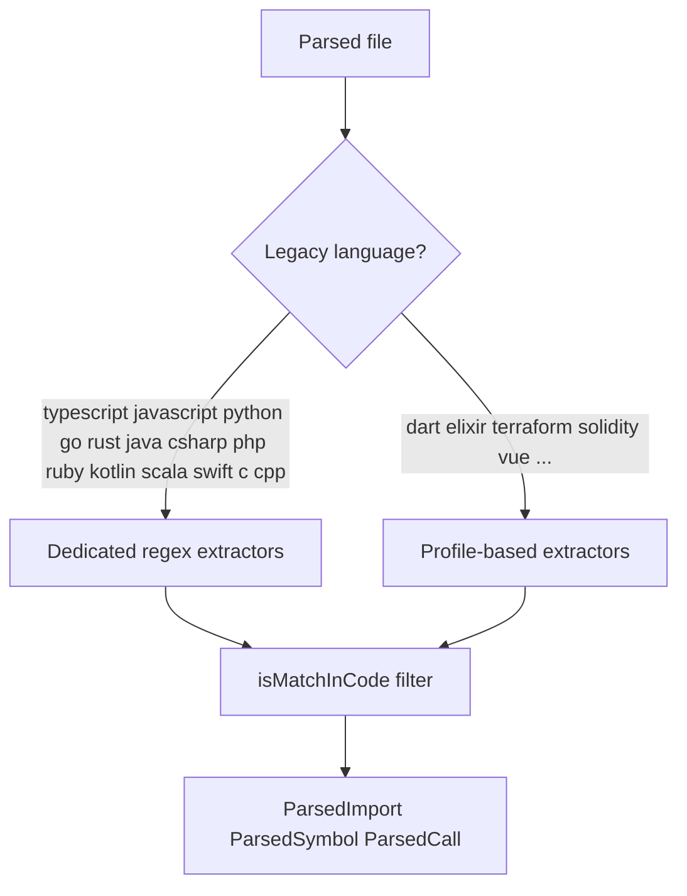

## Risk heatmap

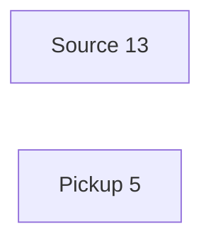

## Architecture smells

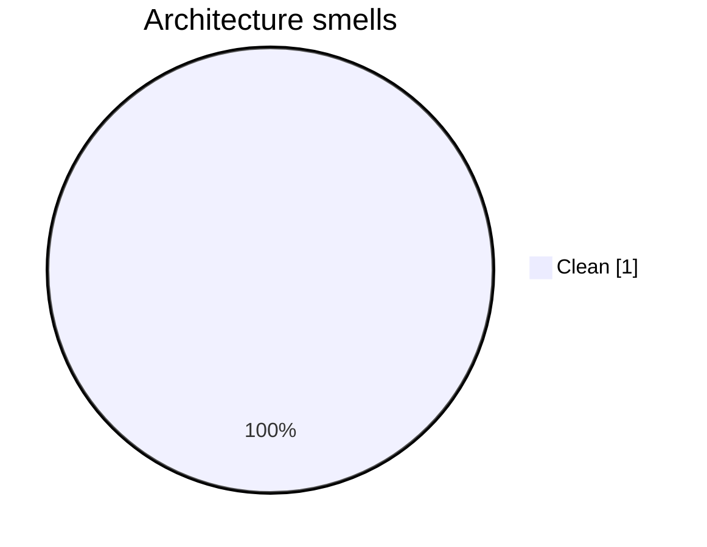

## mnestis build pipeline

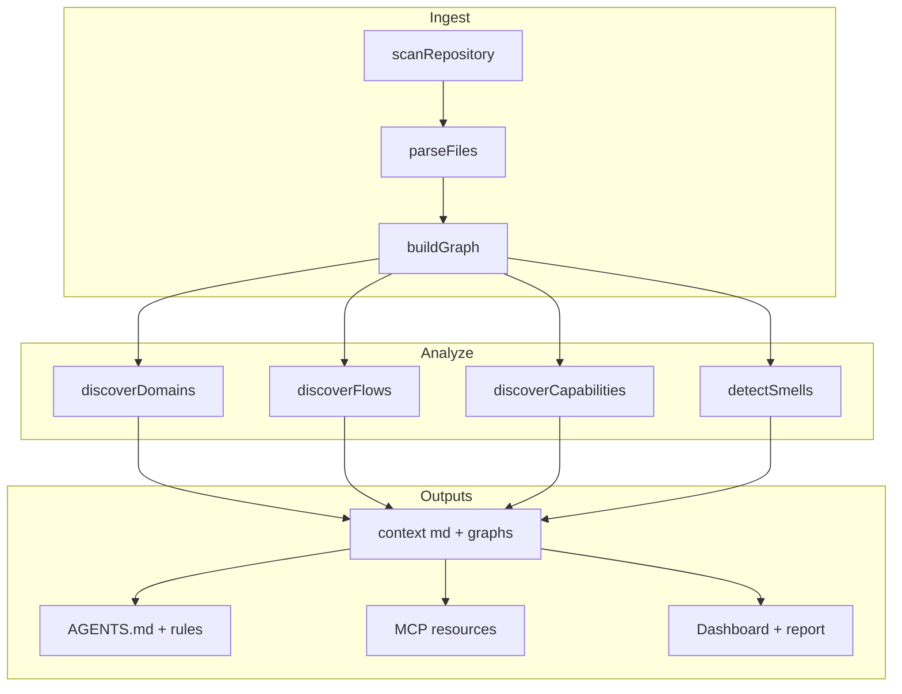

## Related docs

| File | Contents |
|------|----------|
| [architecture.md](./architecture.md) | Layers, services, language section |
| [domains.md](./domains.md) | Domain list + domain graph |
| [flows.md](./flows.md) | All flows + step diagrams |
| [dependencies.md](./dependencies.md) | Top edges + service graph |
| [critical_paths.md](./critical_paths.md) | High-risk edit zones |
| [languages.md](./languages.md) | Full language charts |
