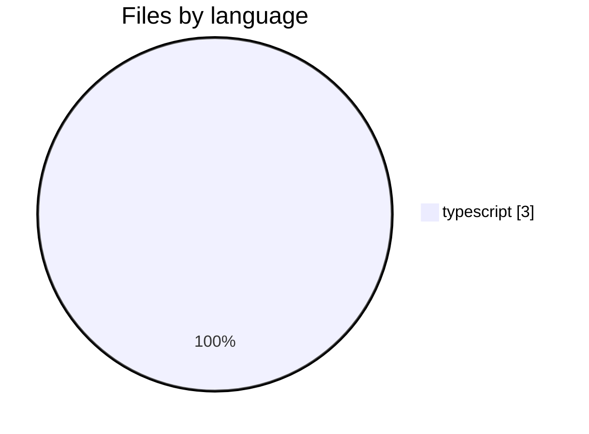
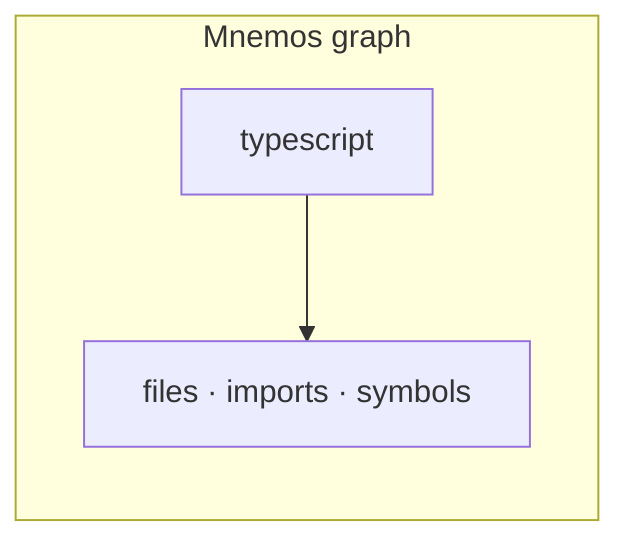
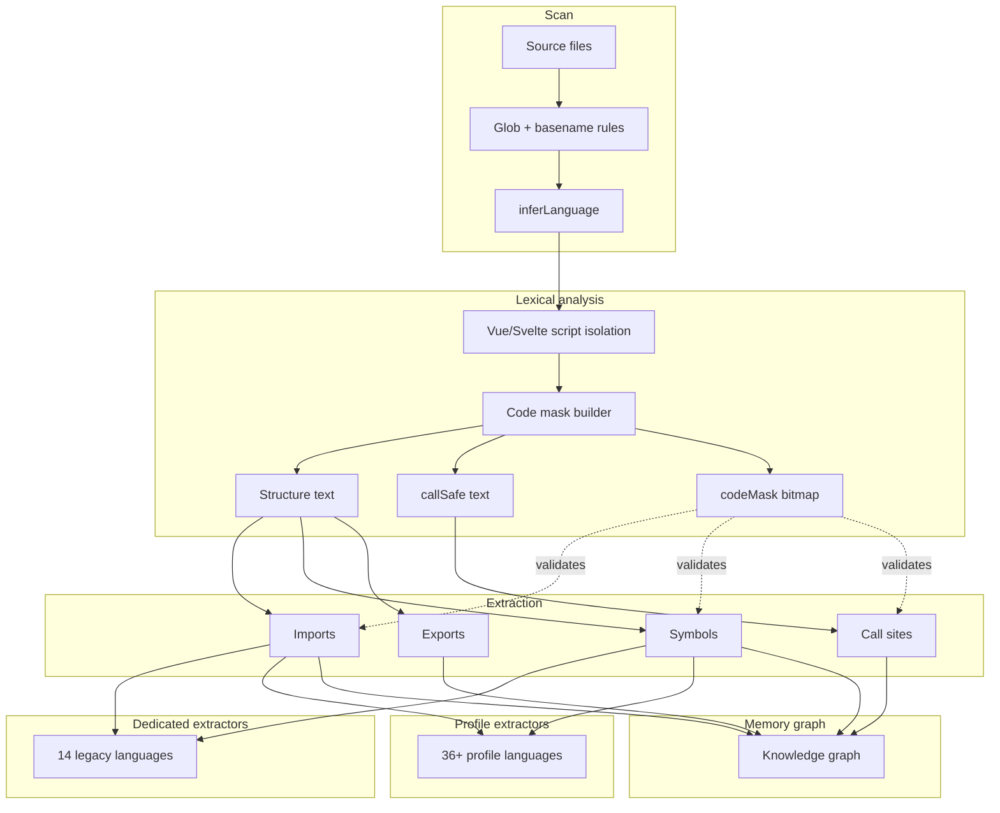
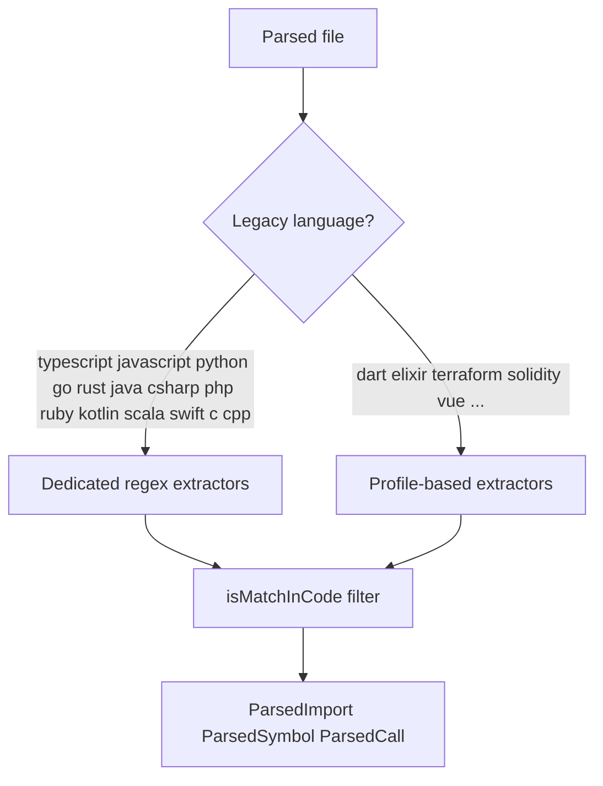
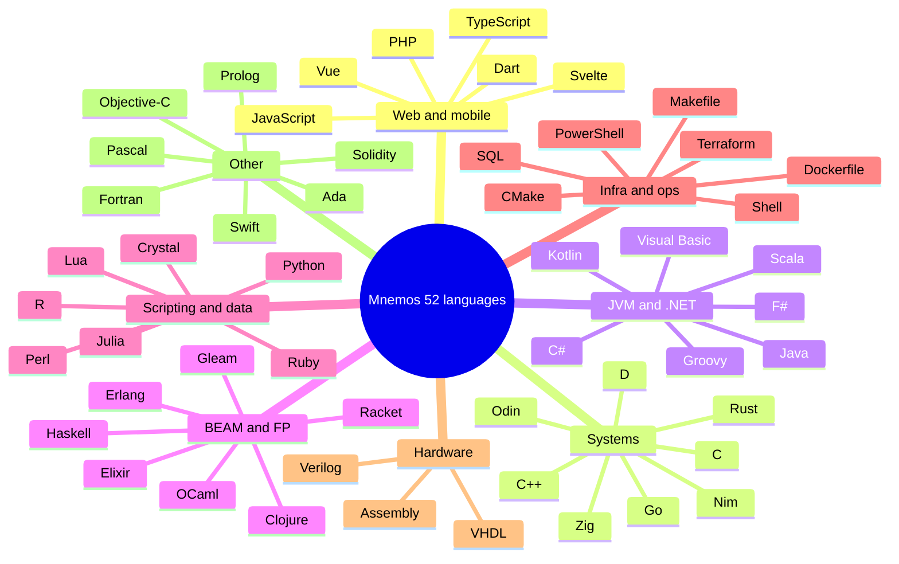

# Languages — sample-app

> Generated by Mnemos · 52 languages supported engine-wide

## This repository

| Metric | Value |
|--------|-------|
| Languages detected | **1** |
| Source files analyzed | **3** |
| Mnemos engine coverage | **52** languages |

## File distribution

## Language breakdown

| Language | Files | Share |
|----------|------:|------:|
| typescript | 3 | 100.0% |

## How files become graph nodes

## Mnemos parsing pipeline (all languages)

## Extractor routing

## Language families (engine coverage)

## Supported but not present in this repo

Mnemos can also analyze: JavaScript, Python, Go, Rust, Java, C#, PHP, Ruby, and 44+ more.

Full list: [docs/LANGUAGES.md](https://github.com/mnemos/mnemos/blob/main/docs/LANGUAGES.md) or `SUPPORTED_LANGUAGES` in `@mnestis/core`.

## For AI agents

- Prefer language stats here over guessing stack from folder names
- Cross-reference `architecture.md` for services and `dependencies.md` for cross-language edges
- Re-run `mnestis build` after adding files in a new language
