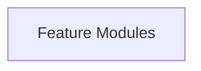
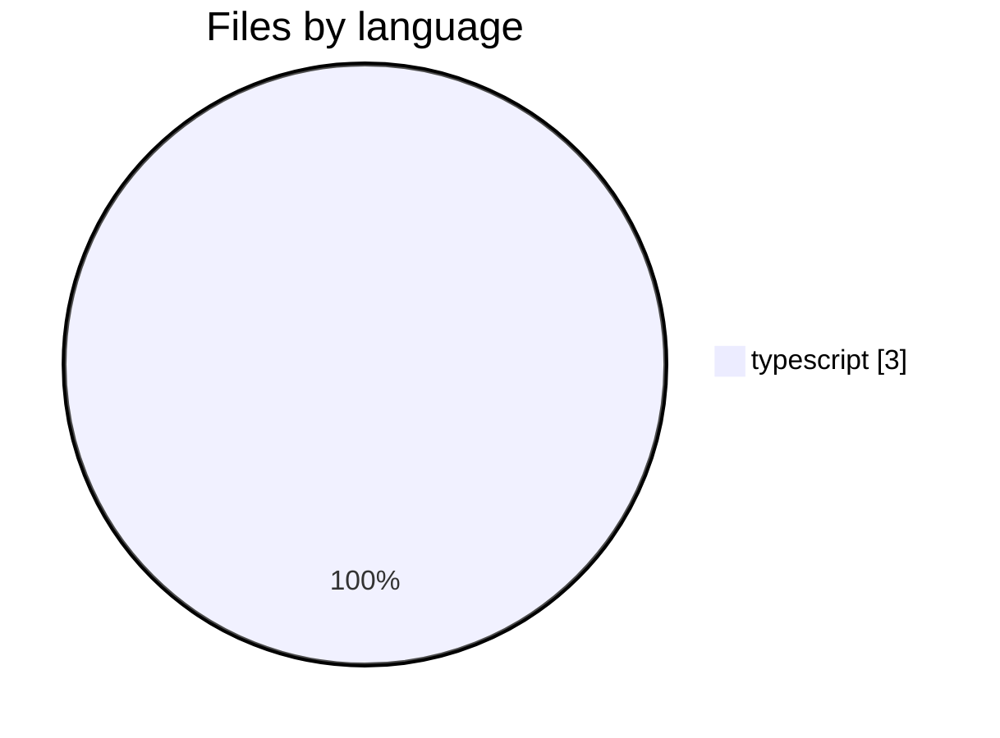
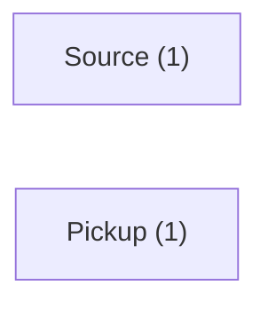

# sample-app — Repository Summary

> Built by Mnemos at 2026-06-24T11:40:03.432Z

## Overview

Single Package with 3 source files across typescript. 0 packages detected. 2 execution flows; core domains: Source, Pickup.

## Stats

| Metric | Value |
|--------|-------|
| Files scanned | 3 |
| Graph nodes | 15 |
| Graph edges | 15 |
| Domains discovered | 2 |
| Flows detected | 2 |
| Build time | 0.1s |

## Architecture Type

**Single Package** with layers: Feature Modules

## Languages

- **typescript**: 3 files

See **[languages.md](./languages.md)** for distribution charts and the Mnemos parsing pipeline.

## Packages

## Quick Navigation

- 2 logical domains
- 2 execution flows
- 1 API/route endpoints
- 2 services
- 0 architecture smells detected

## At a glance

## Languages in this repo

## Top domains

See **[graphs.md](./graphs.md)** for the full diagram set.
